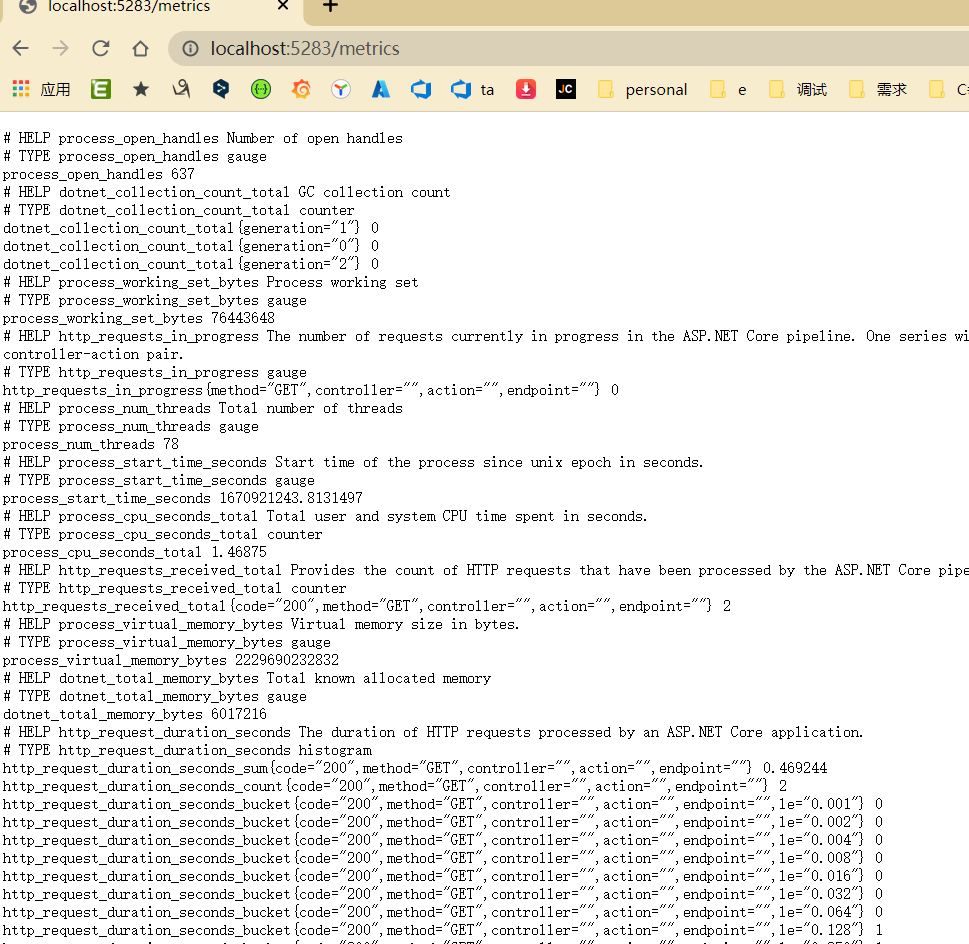

# 写在前面

本文档均以Net6为例；


# 一、Prometheus集成

**1、安装prometheus agent,webapi 安装**

```
Install-Package prometheus-net.AspNetCore
```

**2、Program.cs(or startup.cs) 加上以下3行配置**

```
var app = builder.Build();

app.UseMetricServer(); //1
app.UseHttpMetrics();//2

if (app.Environment.IsProduction() == false)
{
    app.UseSwagger();
    app.UseSwaggerUI();
}
app.UseAuthorization();
app.MapControllers();

app.MapMetrics(); //3

```

注意顺序；

**3、验证/metrics endpoint**



这样就成功了；


# 二、配置中心


三、日志中心


四、